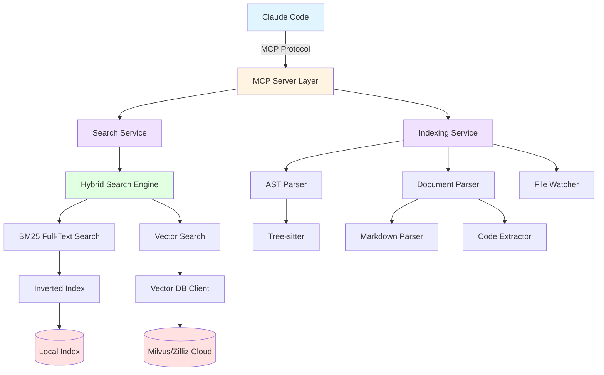
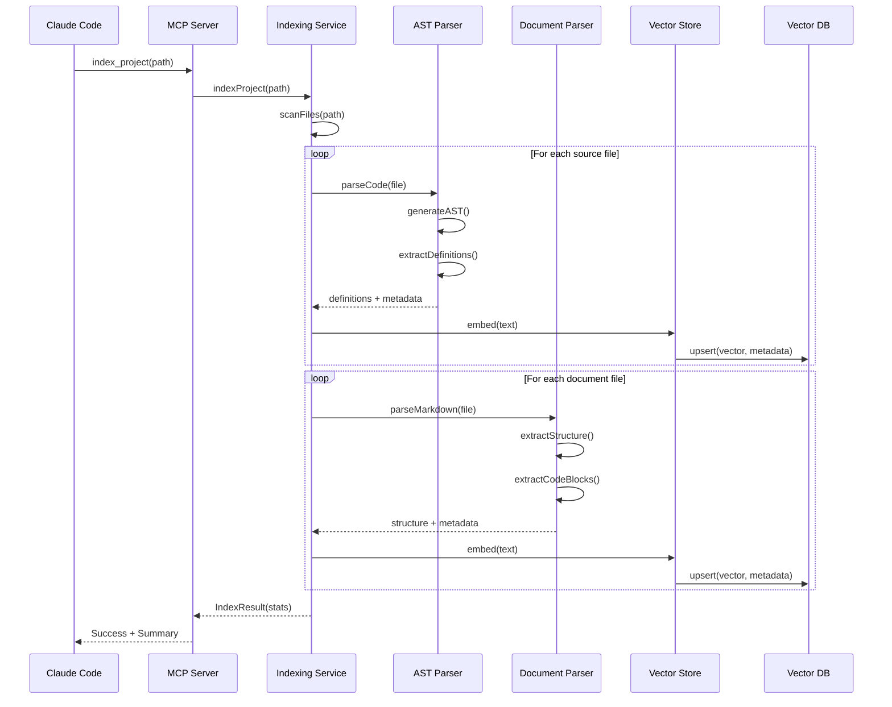
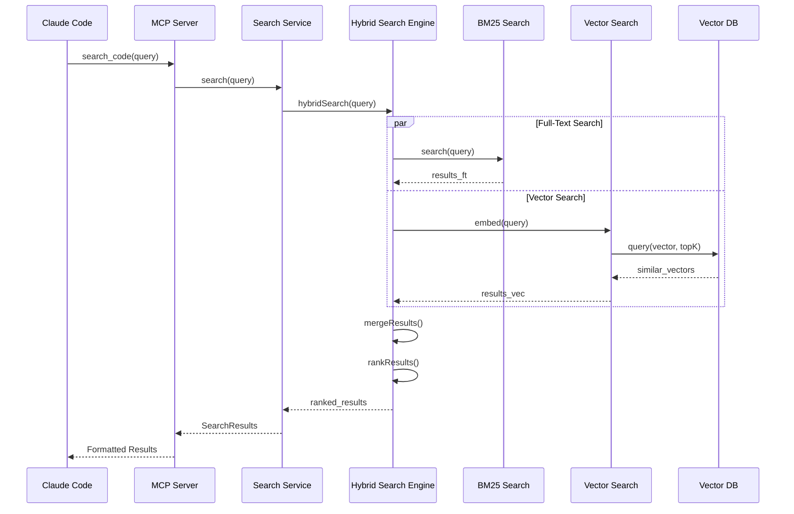
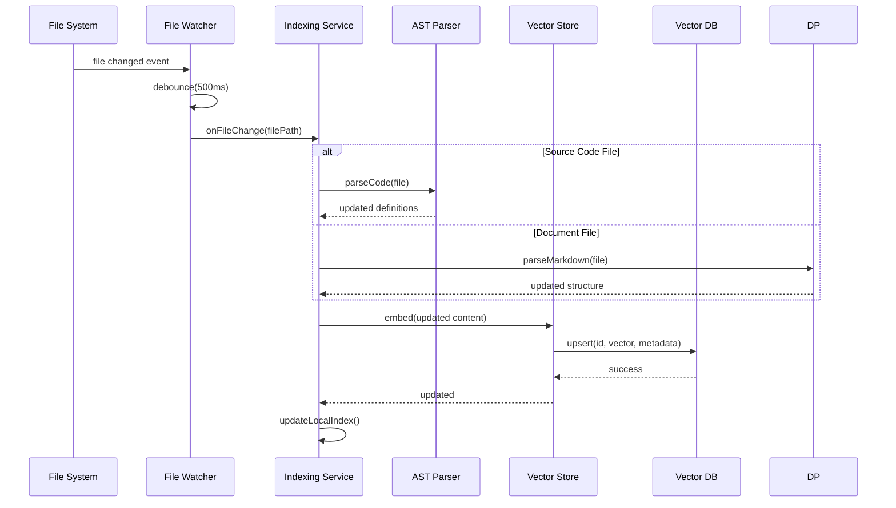
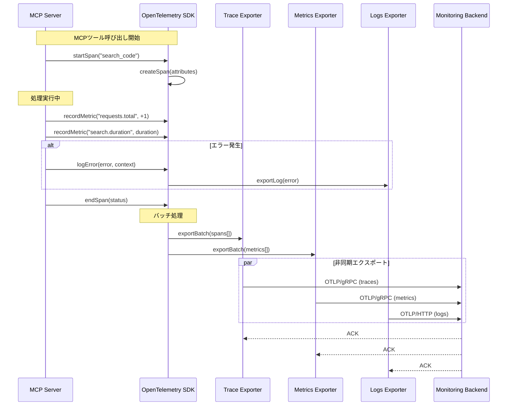

# 設計：Context-MCP（Language Server Protocol based MCP）

## アーキテクチャ概要

Context-MCPは、レイヤー化されたアーキテクチャを採用し、各レイヤーが明確な責務を持つ構成となっています。



### レイヤー構成

1. **MCP Server Layer**: Claude Codeとの通信を担当
2. **Service Layer**: ビジネスロジックの実行（検索、インデックス化）
3. **Parser Layer**: ソースコードとドキュメントの解析
4. **Storage Layer**: データの永続化とクエリ実行

## コンポーネント

### コンポーネント1: MCP Server
**目的**: Model Context Protocolに準拠したサーバー実装
**責務**:
- Claude Codeからのリクエスト受信
- ツール（search, index, status等）のルーティング
- レスポンスのフォーマット変換
- エラーハンドリングと適切なエラーメッセージ返却

**インターフェース**:
- `initialize()`: サーバー初期化
- `handleToolCall(toolName, params)`: ツール呼び出しハンドラー
- `shutdown()`: クリーンアップ処理

### コンポーネント2: Indexing Service
**目的**: プロジェクト全体のインデックス化を管理
**責務**:
- ファイルシステムのスキャン
- ファイル種別の判定（ソースコード、ドキュメント、除外対象）
- パーサーへの振り分け
- インデックスデータの保存
- 進捗状況の追跡

**インターフェース**:
- `indexProject(rootPath, options)`: プロジェクト全体のインデックス化
- `indexFile(filePath)`: 単一ファイルのインデックス化
- `deleteIndex(projectId)`: インデックスの削除
- `getIndexStatus(projectId)`: インデックス状況の取得

### コンポーネント3: AST Parser
**目的**: Tree-sitterを使用したソースコード解析
**責務**:
- ソースコードのAST生成
- 関数/クラス/変数定義の抽出
- docstring/コメントの抽出
- スコープ情報の解析
- 依存関係の抽出

**インターフェース**:
- `parseCode(code, language)`: ASTノードの生成
- `extractDefinitions(ast)`: シンボル定義の抽出
- `extractComments(ast)`: コメント情報の抽出
- `getNodeRange(node)`: ノードの位置情報取得

**対応言語とクエリ**:
各言語ごとにTree-sitterクエリを定義

**初期対応言語（優先度：高）**:
- JavaScript / TypeScript
- Python
- Go
- Rust
- Java
- C / C++ (Arduino / PlatformIO含む)

```typescript
// 関数定義の抽出クエリ例（Python）
(function_definition
  name: (identifier) @function.name
  parameters: (parameters) @function.params
  body: (block) @function.body
)

// 関数定義の抽出クエリ例（C/C++ - Arduino/PlatformIO対応）
(function_definition
  declarator: (function_declarator
    declarator: (identifier) @function.name
    parameters: (parameter_list) @function.params)
  body: (compound_statement) @function.body
)

// Arduino setup/loop関数の特別な扱い
(function_definition
  declarator: (function_declarator
    declarator: (identifier) @arduino.function
    (#match? @arduino.function "^(setup|loop)$"))
)
```

**特別な対応**:
- `.ino`ファイル: Arduinoスケッチとして認識、setup()/loop()関数を特別に扱う
- `platformio.ini`: プロジェクト設定ファイルとして解析、ボード・環境情報を抽出

### コンポーネント4: Document Parser
**目的**: ドキュメントファイルの解析
**責務**:
- Markdownの構造解析（見出し、リスト、コードブロック）
- コードブロックからの言語・内容抽出
- ファイルパス・シンボル参照の検出
- リンク構造の抽出

**インターフェース**:
- `parseMarkdown(content)`: Markdown AST生成
- `extractCodeBlocks(ast)`: コードブロック抽出
- `extractReferences(ast)`: 参照情報の抽出
- `buildOutline(ast)`: ドキュメント構造の生成

### コンポーネント5: Hybrid Search Engine
**目的**: ハイブリッド検索の実装
**責務**:
- BM25全文検索の実行
- ベクトル類似検索の実行
- 両検索結果のマージとランキング
- 結果のフィルタリング

**インターフェース**:
- `search(query, options)`: 統合検索
- `fullTextSearch(query, options)`: 全文検索
- `vectorSearch(query, options)`: ベクトル検索
- `mergeResults(fullTextResults, vectorResults)`: 結果のマージ

**検索アルゴリズム**:
```
score = α * BM25_score + (1-α) * vector_similarity_score
where α = 0.3 (デフォルト、設定可能)
```

### コンポーネント6: Embedding Engine
**目的**: テキストの埋め込みベクトル生成（ローカル/クラウド対応）
**責務**:
- 埋め込みプロバイダーの管理（ローカル/クラウド）
- テキストのベクトル化
- バッチ処理とキャッシング
- モデルのロード・初期化

**インターフェース**:
- `initialize(provider, config)`: プロバイダー初期化
- `embed(text)`: 単一テキストの埋め込み
- `embedBatch(texts[])`: 複数テキストの一括埋め込み
- `getModelInfo()`: 使用中のモデル情報取得

**サポートプロバイダー**:
```typescript
// ローカルプロバイダー（デフォルト）
- TransformersJsProvider: Transformers.js (all-MiniLM-L6-v2等)
- ONNXProvider: ONNX Runtime (軽量モデル)

// クラウドプロバイダー（オプション）
- OpenAIProvider: text-embedding-3-small/large
- VoyageAIProvider: voyage-code-2
```

### コンポーネント7: Vector Store
**目的**: ベクトルデータの管理（ローカル/クラウド対応）
**責務**:
- ベクターDBへの保存
- 類似ベクトル検索
- メタデータ管理
- バックエンドの切り替え

**インターフェース**:
- `connect(backend, config)`: バックエンド接続
- `upsert(id, vector, metadata)`: ベクトルの挿入/更新
- `query(vector, topK)`: 類似検索
- `delete(id)`: ベクトルの削除

**サポートバックエンド**:
```typescript
// ローカルバックエンド（デフォルト）
- MilvusBackend: Milvus standalone (Docker Compose、localhost:19530)

// クラウドバックエンド（オプション）
- ZillizBackend: Zilliz Cloud (Milvusマネージドサービス)
```

### コンポーネント8: File Watcher
**目的**: ファイルシステムの変更監視
**責務**:
- ファイル作成/更新/削除の検知
- 変更イベントのデバウンス処理
- インデックス更新のトリガー

**インターフェース**:
- `watch(paths, patterns)`: 監視開始
- `unwatch()`: 監視停止
- `onFileChange(callback)`: 変更イベントハンドラー

### コンポーネント9: Environment-based Configuration System
**目的**: 環境変数のみで動作可能なゼロコンフィグ設定システム
**責務**:
- デフォルト設定の提供（ローカルモード、Milvus standalone、Transformers.js）
- 環境変数からの設定読み込み
- 設定ファイルとのマージ
- 設定の優先順位適用（環境変数 > 設定ファイル > デフォルト）
- 適用された設定のログ出力

**インターフェース**:
- `loadConfig()`: 設定読み込み（環境変数、ファイル、デフォルトをマージ）
- `getConfig()`: 現在の設定取得
- `validateConfig(config)`: 設定のバリデーション
- `applyEnvironmentOverrides(config)`: 環境変数によるオーバーライド

**サポート環境変数**:
```typescript
// モード設定
CONTEXT_MCP_MODE: 'local' | 'cloud'

// ベクターDB設定
CONTEXT_MCP_VECTOR_BACKEND: 'milvus' | 'zilliz'
CONTEXT_MCP_VECTOR_ADDRESS: string  // 例: 'localhost:19530'
CONTEXT_MCP_VECTOR_TOKEN: string    // Zilliz Cloud認証用

// 埋め込み設定
CONTEXT_MCP_EMBEDDING_PROVIDER: 'transformers' | 'openai' | 'voyageai'
CONTEXT_MCP_EMBEDDING_API_KEY: string  // クラウドプロバイダー用
CONTEXT_MCP_EMBEDDING_MODEL: string    // モデル名（省略可）

// ログ設定
LOG_LEVEL: 'DEBUG' | 'INFO' | 'WARN' | 'ERROR'
```

**設定の優先順位**:
```
優先度（高）
  ↓
1. 環境変数（CONTEXT_MCP_MODE等）
  ↓
2. ユーザー設定ファイル（.context-mcp.json）
  ↓
3. デフォルト設定（types.ts内のDEFAULT_CONFIG）
  ↓
優先度（低）
```

**ゼロコンフィグモード**:
- 設定ファイルが存在しない場合、デフォルト設定で起動
- 環境変数で必要最小限の設定（モード、ベクターDBアドレス等）を指定可能
- Docker Compose起動 + MCP設定（環境変数）のみで即座に使用開始

### コンポーネント10: OpenTelemetry Instrumentation
**目的**: MCPサーバーの可観測性（Observability）提供
**責務**:
- OpenTelemetry SDKの初期化と設定
- トレース、メトリクス、ログの3つの観測シグナルの収集
- OTLPエクスポーター経由での外部バックエンドへの送信
- 分散トレーシングのコンテキスト伝播
- 監視オーバーヘッドの最小化

**インターフェース**:
- `initialize(config)`: OpenTelemetry SDK初期化
- `createSpan(name, attributes)`: トレーススパン作成
- `recordMetric(name, value, labels)`: メトリクス記録
- `logError(error, context)`: エラーログ出力
- `shutdown()`: グレースフルシャットダウン

**収集する観測シグナル**:

1. **トレース（Trace）**:
   - MCPツール呼び出し（tool.name, tool.params, tool.duration）
   - ベクターDB操作（operation.type, operation.duration, operation.status）
   - AST解析（language, file.path, parse.duration）
   - 埋め込み生成（provider, model, batch.size, embed.duration）
   - ハイブリッド検索（query, search.type, search.duration）

2. **メトリクス（Metrics）**:
   - `context_mcp.requests.total`: リクエスト総数（Counter）
   - `context_mcp.requests.duration`: リクエスト処理時間（Histogram）
   - `context_mcp.requests.errors`: エラー発生回数（Counter）
   - `context_mcp.index.files`: インデックス済みファイル数（Gauge）
   - `context_mcp.index.symbols`: インデックス済みシンボル数（Gauge）
   - `context_mcp.search.results`: 検索結果数（Histogram）
   - `context_mcp.memory.usage`: メモリ使用量（Gauge）
   - `context_mcp.vectordb.operations`: ベクターDB操作回数（Counter）

3. **ログ（Logs）**:
   - エラーログ（error level）: スタックトレース、エラーコンテキスト
   - 警告ログ（warn level）: パース失敗、リトライ発生等
   - 情報ログ（info level）: 起動完了、設定適用、インデックス完了等
   - デバッグログ（debug level）: 詳細な処理フロー

**サポートエクスポーター**:
```typescript
// OTLPエクスポーター（gRPC/HTTP）
- TraceExporter: @opentelemetry/exporter-trace-otlp-grpc
- MetricsExporter: @opentelemetry/exporter-metrics-otlp-grpc
- LogsExporter: @opentelemetry/exporter-logs-otlp-http

// バックエンド例
- Jaeger（トレース可視化）
- Grafana Tempo（トレース）
- Prometheus（メトリクス）
- Grafana Loki（ログ）
```

**環境変数サポート**:
```typescript
// OpenTelemetry標準環境変数
OTEL_EXPORTER_OTLP_ENDPOINT: string       // OTLPエンドポイント
OTEL_EXPORTER_OTLP_PROTOCOL: 'grpc' | 'http/protobuf'
OTEL_SERVICE_NAME: string                 // サービス名（デフォルト: 'context-mcp'）
OTEL_TRACES_EXPORTER: 'otlp' | 'console' | 'none'
OTEL_METRICS_EXPORTER: 'otlp' | 'console' | 'none'
OTEL_LOGS_EXPORTER: 'otlp' | 'console' | 'none'

// カスタム環境変数
CONTEXT_MCP_TELEMETRY_ENABLED: 'true' | 'false'  // テレメトリ有効化
CONTEXT_MCP_TELEMETRY_SAMPLE_RATE: number        // トレースサンプリングレート（0.0-1.0）
```

**パフォーマンス考慮事項**:
- 非同期エクスポート: メイン処理をブロックしない
- バッチ処理: 複数のスパン/メトリクスをまとめて送信
- サンプリング: 高頻度操作のトレースはサンプリング（デフォルト10%）
- 条件付き計測: テレメトリ無効時はオーバーヘッドゼロ

## データフロー

### シーケンス1: プロジェクトインデックス化



### シーケンス2: セマンティック検索



### シーケンス3: インクリメンタル更新



### シーケンス4: テレメトリデータ収集とエクスポート



## MCPツール定義

### ツール1: index_project

**目的**: プロジェクト全体をインデックス化

**パラメータ**:
```json
{
  "rootPath": {
    "type": "string",
    "description": "プロジェクトのルートパス",
    "required": true
  },
  "languages": {
    "type": "array",
    "items": { "type": "string" },
    "description": "対象言語（省略時は自動検出）",
    "required": false
  },
  "excludePatterns": {
    "type": "array",
    "items": { "type": "string" },
    "description": "除外パターン",
    "required": false,
    "default": ["node_modules", ".git", "dist", "build"]
  },
  "includeDocuments": {
    "type": "boolean",
    "description": "ドキュメントファイルを含めるか",
    "required": false,
    "default": true
  }
}
```

**レスポンス**:
```json
{
  "status": "success",
  "projectId": "abc123",
  "stats": {
    "totalFiles": 1523,
    "sourceFiles": 1234,
    "documentFiles": 289,
    "indexedSymbols": 5678,
    "processingTime": "2m 34s",
    "errors": []
  }
}
```

### ツール2: search_code

**目的**: セマンティックコード検索

**パラメータ**:
```json
{
  "query": {
    "type": "string",
    "description": "検索クエリ（自然言語またはキーワード）",
    "required": true
  },
  "projectId": {
    "type": "string",
    "description": "検索対象プロジェクトID",
    "required": false
  },
  "fileTypes": {
    "type": "array",
    "items": { "type": "string" },
    "description": "検索対象ファイルタイプ",
    "required": false,
    "enum": ["code", "document", "all"],
    "default": "all"
  },
  "topK": {
    "type": "number",
    "description": "取得する結果数",
    "required": false,
    "default": 20,
    "minimum": 1,
    "maximum": 100
  }
}
```

**レスポンス**:
```json
{
  "results": [
    {
      "filePath": "src/services/search.ts",
      "lineStart": 42,
      "lineEnd": 58,
      "snippet": "async function searchCode(query: string) {...}",
      "type": "function_definition",
      "language": "typescript",
      "score": 0.92,
      "metadata": {
        "functionName": "searchCode",
        "parameters": ["query"],
        "docstring": "Executes semantic code search"
      }
    }
  ],
  "totalResults": 15,
  "queryTime": "234ms"
}
```

### ツール3: get_symbol

**目的**: シンボル（関数、クラス等）の定義と使用箇所を取得

**パラメータ**:
```json
{
  "symbolName": {
    "type": "string",
    "description": "シンボル名",
    "required": true
  },
  "symbolType": {
    "type": "string",
    "description": "シンボルタイプ",
    "required": false,
    "enum": ["function", "class", "variable", "interface", "type", "all"],
    "default": "all"
  }
}
```

**レスポンス**:
```json
{
  "definitions": [
    {
      "filePath": "src/utils.ts",
      "line": 10,
      "snippet": "function parseConfig(path: string): Config",
      "scope": "module"
    }
  ],
  "references": [
    {
      "filePath": "src/main.ts",
      "line": 25,
      "context": "const config = parseConfig('./config.json')"
    }
  ]
}
```

### ツール4: find_related_docs

**目的**: コードに関連するドキュメントを検索

**パラメータ**:
```json
{
  "filePath": {
    "type": "string",
    "description": "ソースコードファイルパス",
    "required": true
  },
  "symbolName": {
    "type": "string",
    "description": "特定のシンボル名（省略可）",
    "required": false
  }
}
```

**レスポンス**:
```json
{
  "relatedDocs": [
    {
      "docPath": "docs/api/search.md",
      "section": "## Search API",
      "relevance": 0.88,
      "excerpts": [
        "The search function accepts a query string and returns..."
      ]
    }
  ]
}
```

### ツール5: get_index_status

**目的**: インデックス状況の取得

**パラメータ**:
```json
{
  "projectId": {
    "type": "string",
    "description": "プロジェクトID（省略時は全プロジェクト）",
    "required": false
  }
}
```

**レスポンス**:
```json
{
  "projects": [
    {
      "projectId": "abc123",
      "rootPath": "/path/to/project",
      "status": "indexed",
      "lastIndexed": "2025-11-02T10:30:00Z",
      "stats": {
        "totalFiles": 1523,
        "totalSymbols": 5678
      }
    }
  ]
}
```

### ツール6: clear_index

**目的**: インデックスのクリア

**パラメータ**:
```json
{
  "projectId": {
    "type": "string",
    "description": "クリア対象プロジェクトID",
    "required": true
  }
}
```

## データベーススキーマ

### Vector DB コレクション: code_vectors

| フィールド | 型 | 説明 |
|-----------|------|------|
| id | string | 一意識別子（ファイルパス:行番号） |
| vector | float[] | 埋め込みベクトル（次元数: モデルに依存） |
| project_id | string | プロジェクトID |
| file_path | string | ファイルパス |
| language | string | プログラミング言語 |
| type | string | エントリタイプ（function, class, document等） |
| name | string | シンボル名 |
| line_start | int | 開始行番号 |
| line_end | int | 終了行番号 |
| snippet | string | コードスニペット（最大500文字） |
| docstring | string | docstring/コメント |
| scope | string | スコープ情報 |
| metadata | json | 追加メタデータ |
| created_at | timestamp | 作成日時 |
| updated_at | timestamp | 更新日時 |

### Local Index（SQLite）: inverted_index

```sql
CREATE TABLE inverted_index (
  term TEXT NOT NULL,
  document_id TEXT NOT NULL,
  frequency INTEGER NOT NULL,
  positions TEXT, -- JSON array
  PRIMARY KEY (term, document_id)
);

CREATE INDEX idx_term ON inverted_index(term);
CREATE INDEX idx_doc_id ON inverted_index(document_id);
```

## 技術的決定事項

### 決定1: Tree-sitterの採用

**検討した選択肢**:
1. **Tree-sitter** - インクリメンタルパース、多言語対応、高速
2. Babel/TypeScript Parser - JavaScript/TypeScript特化、既存エコシステム
3. Language Server Protocol - 言語サーバー活用、高機能

**決定**: Tree-sitter
**根拠**:
- 40以上の言語に対応済み、拡張性が高い
- エラー耐性があり、部分的に壊れたコードも解析可能
- インクリメンタルパースによる高速更新
- Rustで実装され、パフォーマンスが優れている
- Node.jsバインディングが公式提供

### 決定2: ハイブリッド検索の採用

**検討した選択肢**:
1. **ハイブリッド検索（BM25 + Vector）** - 高精度、バランス型
2. ベクトル検索のみ - セマンティック理解重視
3. 全文検索のみ - 実装シンプル、軽量

**決定**: ハイブリッド検索
**根拠**:
- キーワード完全一致とセマンティック検索の両方の利点を活用
- Claude Contextの評価で高い精度を実証済み
- ユーザーの検索意図に柔軟に対応可能
- 重み付け調整により精度チューニング可能

### 決定3: ベクターDBバックエンドのプラグイン化

**検討した選択肢**:
1. Milvus（standalone/クラウド両対応） - 高機能、スケーラブル、統一された体験
2. 複数DB対応（プラグイン方式） - 柔軟性高いが、メンテナンスコスト大
3. ローカルDBのみ（ChromaやDuckDB等） - セットアップ容易だが機能制限

**決定**: Milvusのみサポート（standalone + Zilliz Cloud）
**根拠**:
- コードベースの簡潔性とメンテナンス性を優先
- Milvus standaloneでローカル実行可能（Docker Compose）
- Zilliz Cloudでクラウド実行可能（シームレスな移行パス）
- 高性能で安定しており、豊富なドキュメント
- プラグインインターフェースは残し、将来の拡張性を確保

### 決定4: Node.js実装

**検討した選択肢**:
1. **Node.js/TypeScript** - Claude Code連携容易、npm豊富
2. Rust - 高性能、メモリ安全
3. Python - ML/AIツール豊富、開発速度

**決定**: Node.js/TypeScript
**根拠**:
- Claude CodeがElectronベースでNode.js環境
- MCPのNode.js SDKが公式提供
- Tree-sitterのNode.jsバインディング利用可
- TypeScriptによる型安全性

### 決定5: ローカルファースト設計

**検討した選択肢**:
1. **ローカル優先（デフォルトローカル、オプションでクラウド）** - プライバシー重視、柔軟性
2. クラウド優先（デフォルトクラウド、オプションでローカル） - 高性能、セットアップ簡単
3. クラウドのみ - 最高性能、実装シンプル

**決定**: ローカルファースト設計
**根拠**:
- **プライバシー保護**: 企業コードや個人情報を外部に送信しない
- **セキュリティ**: 認証情報やAPIキーの管理が不要（ローカルモード時）
- **コスト削減**: OpenAI/VoyageAI等のAPI利用料が不要
- **オフライン対応**: インターネット接続なしでも動作
- **規制対応**: GDPR、企業ポリシー等の制約に対応可能
- **ユーザー選択の尊重**: クラウドモードも選択可能で柔軟性を維持

**実装アプローチ**:
- デフォルトはローカル埋め込みモデル（Transformers.js）
- デフォルトはローカルベクターDB（Milvus standalone）
- 設定で簡単にクラウドモードに切り替え可能（Zilliz Cloud）
- 初回セットアップ時にモード選択を提示
- Docker Composeで簡単にMilvus standaloneを起動

### 決定6: ゼロコンフィグ設計（環境変数ベース設定）

**検討した選択肢**:
1. **環境変数ベースのゼロコンフィグ** - 設定ファイル不要、即座に使用開始可能
2. 設定ファイル必須 - 設定の一元管理、Git管理可能
3. 対話式ウィザード必須 - ユーザーフレンドリー、ガイド付きセットアップ

**決定**: 環境変数ベースのゼロコンフィグ（設定ファイルはオプション）
**根拠**:
- **即座に使用開始**: Docker Compose起動 + MCP設定のみで動作
- **Claude Code統合の簡素化**: claude_desktop_config.jsonの環境変数セクションで完結
- **CI/CD対応**: 環境変数による設定変更が容易
- **柔軟性**: 設定ファイル（.context-mcp.json）も並行サポート、用途に応じて選択可能
- **デフォルトの妥当性**: ローカルモード + Milvus localhost:19530 + Transformers.jsが多くのユースケースをカバー

**設定の優先順位**:
```
1. 環境変数（最優先）
   ↓ 上書き
2. ユーザー設定ファイル（.context-mcp.json）
   ↓ 補完
3. デフォルト設定（DEFAULT_CONFIG）
```

**実装アプローチ**:
- ConfigManagerの`applyEnvironmentOverrides()`で環境変数を適用（既存実装を活用）
- 設定ファイルが存在しない場合もエラーにせず、デフォルト設定で起動
- 起動時に適用された設定をINFOレベルでログ出力
- ドキュメントでゼロコンフィグ手順を最上位に配置

**ユーザー体験**:
```bash
# 1. Milvus起動
docker-compose up -d

# 2. Claude Code MCP設定（環境変数のみ）
{
  "mcpServers": {
    "context-mcp": {
      "command": "npx",
      "args": ["github:windschord/context-mcp"],
      "env": {
        "CONTEXT_MCP_MODE": "local",
        "LOG_LEVEL": "INFO"
      }
    }
  }
}

# 3. Claude Code再起動 → 即座に使用可能
```

### 決定7: OpenTelemetryによる可観測性

**検討した選択肢**:
1. **OpenTelemetry** - ベンダー中立、業界標準、トレース/メトリクス/ログ統合
2. カスタムロギング + Prometheus - 軽量、シンプル
3. 監視機能なし - 最軽量、実装コスト最小

**決定**: OpenTelemetry
**根拠**:
- **ベンダー中立性**: 特定の監視バックエンドに依存しない（Jaeger、Grafana、Prometheus等に対応）
- **業界標準**: CNCF（Cloud Native Computing Foundation）プロジェクト、幅広い採用実績
- **統合的な可観測性**: トレース、メトリクス、ログを統一的なAPIで収集
- **分散トレーシング**: 外部サービス（ベクターDB、埋め込みAPI）との連携を可視化
- **豊富なエコシステム**: 自動計測ライブラリ、エクスポーター、ツール群が充実
- **パフォーマンス**: 非同期エクスポート、バッチ処理によりオーバーヘッド最小化

**実装アプローチ**:
- デフォルトで監視機能オフ（オプトイン方式）
- 環境変数（OTEL_EXPORTER_OTLP_ENDPOINT等）での簡単な有効化
- MCPツール呼び出し、ベクターDB操作、AST解析を自動計測
- 条件付きコンパイルによりテレメトリ無効時のオーバーヘッドゼロ
- サンプリング機能により高頻度操作の負荷軽減

**監視可能な情報**:
- **パフォーマンス**: リクエスト処理時間、ベクターDB応答時間、検索レイテンシー
- **エラー追跡**: スタックトレース、エラー発生箇所、コンテキスト情報
- **リソース使用量**: メモリ使用量、インデックス済みファイル数、CPU使用率
- **ビジネスメトリクス**: 検索実行回数、インデックス化頻度、ツール呼び出し統計

## セキュリティ考慮事項

### データの取り扱い
- センシティブファイル（.env, credentials等）の自動除外
- ベクターDBへのデータ送信前のプライバシーチェック
- ローカル実行オプション（埋め込みモデルもローカル）の提供

### 認証情報の保護
- APIキーはOS標準のキーチェーンに保存
- 設定ファイル内の平文保存を禁止
- 環境変数からの読み取りサポート

### 通信の暗号化
- ベクターDBへの接続はTLS/SSL必須
- 埋め込みAPI通信もHTTPS必須

## パフォーマンス考慮事項

### インデックス化の最適化
- ファイル並列処理（ワーカースレッド活用）
- バッチ埋め込み（複数テキストを一度にベクトル化）
- 差分更新（変更ファイルのみ処理）

### 検索の最適化
- ローカルキャッシュ（頻出クエリ結果）
- ベクトルDBのインデックス最適化（HNSW等）
- 結果のページネーション

### メモリ管理
- ストリーミング処理（大規模ファイル対応）
- 定期的なガベージコレクション
- Vector Store接続プーリング

## エラー処理

### エラーカテゴリ
1. **設定エラー**: 不正な設定、APIキー未設定
2. **ファイルシステムエラー**: 読み取り権限なし、ファイル不存在
3. **パースエラー**: 構文エラー、非対応言語
4. **ネットワークエラー**: ベクターDB接続失敗、APIタイムアウト
5. **データエラー**: インデックス破損、不整合

### リカバリー戦略
- パースエラー: 該当ファイルをスキップし、他のファイル処理続行
- ネットワークエラー: ローカルキャッシュにフォールバック、リトライ
- データエラー: 自動再構築提案、バックアップからの復元

### ユーザー通知
```typescript
interface ErrorResponse {
  error: {
    code: string;
    message: string;
    details?: any;
    suggestion?: string; // 対処方法の提案
    recoverable: boolean;
  }
}
```

## 拡張性設計

### プラグインインターフェース
新しいパーサーやベクターDBの追加を容易にする

```typescript
interface ParserPlugin {
  name: string;
  extensions: string[];
  parse(content: string): ParseResult;
}

interface VectorStorePlugin {
  name: string;
  connect(config: any): Promise<void>;
  upsert(vectors: Vector[]): Promise<void>;
  query(vector: number[], topK: number): Promise<QueryResult[]>;
}
```

### 設定のスキーマ
`.context-mcp.json`でカスタマイズ可能

```json
{
  "version": "1.0",
  "mode": "local",
  "excludePatterns": ["node_modules", "dist", ".git", ".env"],
  "languages": {
    "typescript": {
      "parser": "tree-sitter-typescript",
      "enabled": true
    },
    "python": {
      "parser": "tree-sitter-python",
      "enabled": true
    }
  },
  "vectorStore": {
    "backend": "milvus",
    "config": {
      "address": "localhost:19530",
      "standalone": true,
      "dataPath": "./volumes"
    }
  },
  "embedding": {
    "provider": "transformers",
    "model": "Xenova/all-MiniLM-L6-v2",
    "local": true
  },
  "search": {
    "hybridWeight": 0.3,
    "topK": 20
  },
  "privacy": {
    "blockExternalCalls": true,
    "allowedDomains": []
  },
  "telemetry": {
    "enabled": false,
    "otlp": {
      "endpoint": "http://localhost:4317",
      "protocol": "grpc"
    },
    "serviceName": "context-mcp",
    "samplingRate": 0.1,
    "exporters": {
      "traces": "otlp",
      "metrics": "otlp",
      "logs": "otlp"
    }
  }
}
```

**ローカルモード設定例（デフォルト）**:
```json
{
  "mode": "local",
  "vectorStore": {
    "backend": "milvus",
    "config": {
      "address": "localhost:19530",
      "standalone": true,
      "dataPath": "./volumes"
    }
  },
  "embedding": {
    "provider": "transformers",
    "model": "Xenova/all-MiniLM-L6-v2",
    "local": true
  },
  "privacy": {
    "blockExternalCalls": true
  }
}
```

**ローカルモード設定例**:
```json
{
  "mode": "local",
  "vectorStore": {
    "backend": "milvus",
    "config": {
      "address": "localhost:19530",
      "standalone": true
    }
  },
  "embedding": {
    "provider": "transformers",
    "model": "Xenova/all-MiniLM-L6-v2"
  },
  "privacy": {
    "blockExternalCalls": true
  }
}
```

**クラウドモード設定例**:
```json
{
  "mode": "cloud",
  "vectorStore": {
    "backend": "zilliz",
    "config": {
      "address": "your-instance.zilliz.com:19530",
      "token": "${ZILLIZ_TOKEN}"
    }
  },
  "embedding": {
    "provider": "openai",
    "model": "text-embedding-3-small",
    "apiKey": "${OPENAI_API_KEY}"
  },
  "privacy": {
    "blockExternalCalls": false
  }
}
```
